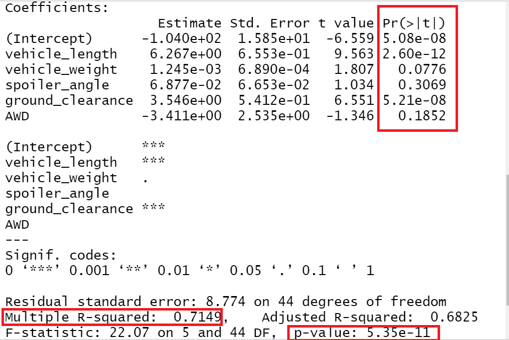
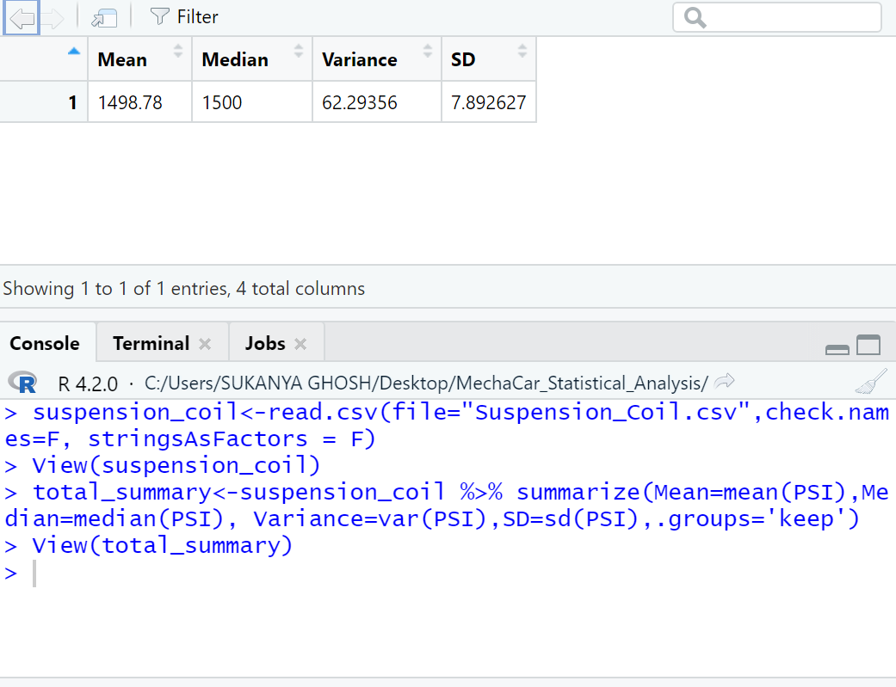
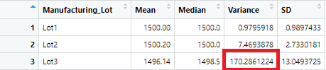
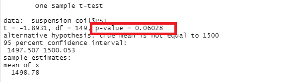
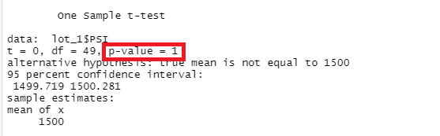
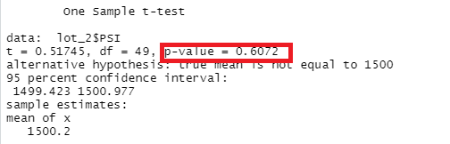
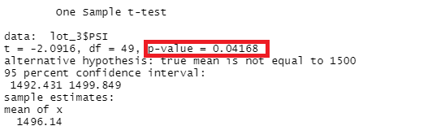

# MechaCar_Statistical_Analysis
Statistical Analysis using R

## Overview & Purpose

The purpose of the project is to help AutosRUs' newest prototype Mechacar, which is suffering from production troubles and blocking the manufacturing team's progress. The AutosRUs' management team wants the data analytics team to review the production data for insights that may help the manufacturing team. The data analytics team is required to perform the following tasks -

- Perform multiple linear regression analysis to identify which variables in the dataset predict the mpg of MechaCar prototypes
- Collect summary statistics on the pounds per square inch (PSI) of the suspension coils from the manufacturing lots
- Run t-tests to determine if the manufacturing lots are statistically different from the mean population
- Design a statistical study to compare vehicle performance of the MechaCar vehicles against vehicles from other manufacturers. For each statistical analysis, you’ll write a summary interpretation of the findings.

## Resources

#### Data Used
MechaCar_mpg.csv
Suspension_Coil.csv

#### Software
- R 4.2.0
- RStudio
- VS Code

## Deliverable 1 - Linear Regression to Predict MPG

**1. Which variables/coefficients provided a non-random amount of variance to the mpg values in the dataset?**

At a confidence level of 95%, the significance level is 0.05. Therefore, the p-value should be less than 0.05 to be statistically significant.
  
As a result, the variables or coefficients that provides a non-random amount of variance to the mpg values are vehicle length(Pr(>|t|)=2.60e-12),ground-         clearance(Pr(>|t|)=5.21e-08) and also the intercept(Pr(>|t|)=5.08e-08). 

This indicates that vehicle length and ground clearance have statistically significant impact on fuel efficiency(mpg). Also, the intercept is statistically significant, meaning there are other variables or factors that may contribute to the variation in mpg values but are not included in the linear model.

**2. Is the slope of the linear model considered to be zero? Why or why not?**

In case of linear regression analysis,

H0 : The slope of the linear model is zero 

Ha: The slope of the linear model is not zero

In this case, our p-value is less than our assumed significance level of 0.05

p-value=5.35e-11

p-value<0.05

Therefore, we reject the null hypothesis, which means that the slope of the linear model is not zero.

**3. Does this linear model predict mpg of MechaCar prototypes effectively? Why or why not?**

The r2 value in this case is 0.7149, which means that this linear model can predict approx 71% of mpg values of Mechacar prototypes.

## Deliverable 2 - Summary Statistics on Suspension Coils

**1. The design specifications for the MechaCar suspension coils dictate that the variance of the suspension coils must not exceed 100 pounds per square inch. Does the current manufacturing data meet this design specification for all manufacturing lots in total and each lot individually? Why or why not?**

- In our total_summary dataframe, we can see that the variance for manufacturing lots in total is 62.29 which is less than 100 PSI. Therefore it meets the design specification.

- In our lot_summary dataframe, we can see that the variance for Lot 1 is 1(approx) and lot 2 is 7(approx). Therefore, they are within the design specification limit of 100 PSI. However, the variance for Lot 3 is 170 which is much higher than the design specification limit of 100 PSI.

## Deliverbale 3- T-Tests on Suspension Coils

**1. Determine if the PSI across all manufacturing lots is statistically different from the population mean of 1,500 pounds per square inch.**

- The t-Test for all manufacturing lots show a p-value of 0.06028 which is higher than our assumed significance level of 0.05. Therefore, we fail to reject null hypothesis, which means that the PSI across all manufacturing lots is not statistically different from the presumed population mean of 1500.

**2. Determine if the PSI across manufacturing lot 1 is statistically different from the population mean of 1,500 pounds per square inch.**

- The t-Test for manufacturing lot 1 shows a p-value of 1 which is higher than our assumed significance level of 0.05. Therefore, we fail to reject null hypothesis, which means that the PSI mean across manufacturing lot 1 is not statistically different from the presumed population mean of 1500.

**3. Determine if the PSI across manufacturing lot 2 is statistically different from the population mean of 1,500 pounds per square inch.**

- The t-Test for manufacturing lot 2 shows a p-value of 0.6072 which is again higher than our significance level of 0.05. Therefore, we fail to reject the null hypothesis, which means that there is no statistical difference between sample PSI mean and population mean of 1500.

**4. Determine if the PSI across manufacturing lot 3 is statistically different from the population mean of 1,500 pounds per square inch.**

- The t-Test for manufacturing lot 3 shows a p-value of 0.04168 which is lower than our significance level of 0.05. Therefore, we reject the null hypothesis, meaning that there is a statistically significant difference between the lot 3 mean and the population mean of 1500.

Therefore, we can conclude that something has gone wrong with Manufacturing Lot 3 that is resulting in the production troubles. The company needs to inspect the suspension coils from Manufacturing Lot 3. 

## Deliverable 4 - Study Design: MechaCar vs Competition

#### Metrics

The goal is to design a statistical study to improve vehicle performance of the MechaCar vehicles against vehicles by other manufactureres. Although there are many, one important metric that I think might interest consumers and motivate them to buy from Mechacar instead of other manufacturers is the Resale Value of the car. 

#### Null & Alternative Hypothesis

H0 : There is no statistically significant difference between resale value mean of Mechacar vehicles and other competitors

Ha : There is a statistically significant difference between the resale value mean of Mechacar vehicles and other competitors

#### Statistical Tests

In order to test the above-mentioned hypothesis, we will conduct a one-way ANOVA test. A one-way ANOVA(Analysis of Variance) is used to test the means of a single dependent variable across a single independent variable with multiple groups. In this case, it will allow us to compare the resale value of MechaCar vehicles with several other competitors.

#### Data Required to Run Statistical Test

In order to conduct a one-way ANOVA test, we will require one dependent variable and one independent variable. In this case, our dependent variable would be the Resale Value which is numerical and continuous and the independent variable could be vehicle class which is categorical. We also need to validate that the dependent variable is normally distributed and that the variance among each group is similar. In R, we can use the aov() function along with the summary() function to conduct the the ANOVA test. If the Pr(>F) value is greater than our assumed significance level of 0.05 at 95% confidence level, we can conclude that there is no statistically significant difference between the means of the groups. Otherwise, we will know that atleast one of the means is different from all other groups which would then require us to conduct further tests.

